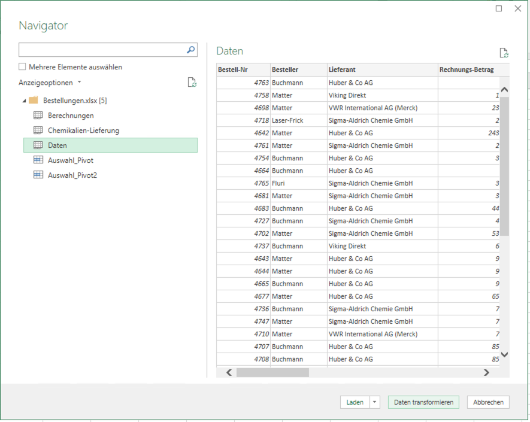
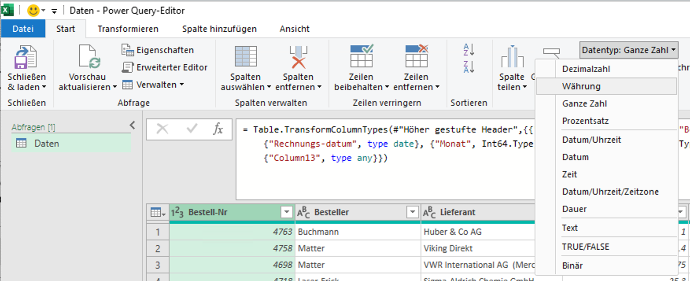

# Daten importieren {#sec-chapter-daten-importieren}

::: {.callout-warning}
## Work in Progress
:::

Viele Excel Arbeitsmappen kombinieren Berechnungen und Daten. Excel kann allerdings auch Daten aus anderen Quellen importieren. Quellen können andere Dateien, Datenbanken oder Web-APIs sein und in verschiedenen Formaten vorliegen. Dafür stellt Excel Parser für verschiedene Dateiformate bereit, damit die Daten importiert werden können. 

Daten werden korrekt mit dem Kommando **Daten abrufen (Power Query)** importiert. Das Kommando ist in der Gruppe **Daten** im Abschnitt **Daten abrufen und transformieren** zu finden. Das Kommando *Daten abrufen* startet die sog. **Power Query** Umgebung. In dieser Umgebung können Daten aus verschiedenen Quellen importiert und vor der Bereitstellung korrigiert werden. 

{#fig-menubalken-power-query-kommando-daten-abrufen}

::: {.callout-tip}
# Power Query

**Power Query** ist eine Umgebung für den Datenimport, die von verschiedenen Microsoft Produkten verwendet wird. Die Umgebung ist in Excel, Power BI, Power Apps und Power Automate verfügbar. Power Query stellt eine einheitliche Schnittstelle für den Datenimport bereit und basiert auf einer *Import-Beschreibungssprache*. Mit diese Sprache lassen sich Daten für die Arbeit vorbereiten, so dass viele Datenbereinigungsschritte in Excel Arbeitsmappen entfallen können.

{#fig-power-query-editor-fenster}

Zu den zentralen Funktionen von Power Query gehören:

- Quellenmanagement
- Überschriftenerkennung
- Schemaerkennung und -transformation
- Entfernen von Duplikaten und ungültigen Werten
- Vektorisierung von Daten
- Kombinieren von Daten aus verschiedenen Quellen
:::

::: {.callout-warning}
Viele tabellarische Dateiformate lassen sich direkt mit Excel öffnen. Das sollte nur mit Excel Arbeitsmappen erfolgen. Bei anderen Dateiformaten kann das direkte öffnen zu Datenverlusten oder Datenfehlern führen. Diese lassen sich in Excel nur umständlich korrigieren. 

Ausserdem lassen sich direkt geöffnete Dateien nicht mehr erweitern, was die Datenerhebung erschwert.
:::

Das Kernprinzip von *Power Query* ist das Verbinden einer Datenquelle mit einer Arbeitsmappen.  Die Datenquelle wird dabei nicht in die Arbeitsmappe übernommen, sondern nur eine Verbindung zu der Datenquelle hergestellt. Dadurch kann eine Datenquelle in mehreren Arbeitsmappen verwendet werden und sich ändern, ohne dass die Arbeitsmappe angepasst werden muss. 

::: {.callout-note}
## Merke
Das Ergebnis eines Imports ist immer eine *Tabelle*.
:::

## Eine Datenverbindung herstellen

Eine Datenverbindung wird über das Kommando `Daten abrufen (Power Query)` ausgelöst. Das Kommando ist in der Gruppe **Daten** im Abschnitt **Daten abrufen und transformieren** zu finden. Das Kommando bereitet den Import durch Power Query vor, indem zuerst das Dateiformat und anschliessend die zugehörige Datenquellen ausgewählt wird. Nach diesen Schritten kann Excel die Daten *landen* oder in Power Query überprüfen und *transformieren* (s. @fig-power-query-laden-oder-transformieren).

::: {.callout-tip}
## Praxis
Die Daten sollten nur in Ausnahmefällen ohne Kontrolle gelanden werden. In der Regel sollten die Daten in Power Query überprüft und transformiert werden. Dadurch wird sichergestellt, dass die Daten korrekt importiert werden.
:::

{#fig-power-query-laden-oder-transformieren}

Wird die Option `Daten transformieren` ausgewählt, öffnet sich der Power Query Editor. In diesem Editor können die Daten überprüft und transformiert werden. Die Daten werden in einer Vorschau angezeigt. Die Vorschau zeigt die ersten 1000 Zeilen der Daten an. 

Standardmässig werden drei bzw. bei Excel Arbeitsmappen vier Schritte in Power Query konfiguriert, wobei der letzte Schritt immer `Geänderter Typ` (Windows) bzw. `geänderter Spaltentyp` (MacOS) ist. Dieser Schritt enthält die Schemadefinition. Power Query versucht das Schema automatisch zu erkennen. Das funktioniert besonders bei Zahlenwerten nicht immer zuverlässig. Deshalb muss das Schema immer kontrolliert und gegebenefalls angepasst werden. 

{#fig-power-query-editor-scheme}

4. Daten gegebenenfalls transformieren
5. Daten importieren

Nach einem Datenimport liegen die Daten in der Arbeitsmappe vor. Diese Daten sind eine Kopie der Daten in der Datenquelle. Die kopierten Werte sind als Tabelle in der Arbeitsmappe gespeichert. Dadurch kann die Arbeitsmappe unabhängig von der Datenquelle verwendet und geteilt werden.

::: {.callout-warning}
## Achtung

Excel betrachtet jeden Datenimport als Sicherheitsproblem. Daher werden Datenverbindungen beim Öffnen einer Arbeitsmappe standardmässig deaktiviert. Beim Öffnen einer Arbeitsmappe mit einer Datenverbindung wird eine Warnung angezeigt. Um mit den importierten Daten arbeiten zu können, muss die Datenverbindung *aktiviert* werden.

Wird die Datenverbindung nicht aktiviert, werden Funktionen die auf die Daten zugreifen nicht ausgeführt, sondern nur die Ergebnisse der letzten Ausführung angezeigt.
:::

## Daten aktualisieren

Die Daten können sich aber ändern, z.B. weil ein Formular ausgefüllt wurde oder eine Datenbank aktualisiert wurde. Dadurch ändern sich die Daten in der Datenquelle. In solchen Fällen ist die Kopie in der Arbeitsmappe nicht mehr aktuell. Um die Daten zu aktualisieren, muss die Datenverbindung aktualisiert werden.

Dazu wird das Kommando **Alle aktualisieren** verwendet. Das Kommando ist im Menu **Daten** im Abschnitt **Verbindungen** zu finden. Das Kommando aktualisiert alle Datenverbindungen in der Arbeitsmappe entsprechend der Importspezifikation.

{#fig-menubalken-daten-kommando-alle-aktualisieren}

Es werden nur die importierten Daten aktualisiert. Wurde die Tabelle durch Formeln erweitert, werden diese Formeln *nicht* gelöscht, sondern auf die neuen Daten erweitert. 

::: {.callout-important}
Die importierte Struktur darf **nicht verändert** werden. Das bedeutet, dass innerhalb der Struktur keine Spalten hinzugefügt oder gelöscht werden dürfen. Neue Spalten für Formeln müssen rechts von der importierten Datenstruktur der Tabelle hinzugefügt werden.
:::

## Datenverbindung anpassen

Gelegentlich ändert sich der Ort einer Datenquelle. Sehr häufig tritt diese Situation ein, wenn eine Datei in einen anderen Ordner verschoben wird. In solchen Fällen muss die Datenverbindung angepasst werden. Dazu muss in Power Query die Datenquelle angepasst werden.

1. Powerquery öffnen
2. Einstellungen im Schritt "Quelle" auswählen (s. @fig-power-query-editor-datenquelle-anpassen)
2. Pfad zur Datenquelle anpassen

Nachdem die richtige Datei ausgewählt wurde, sollte immer das Schema kontrolliert werden, ob die Änderung keine Auswirkungen auf das Schema hat. Wird dieser Schritt übersprungen, kann es zu Fehlern beim Import kommen und im schlimmsten Fall werden die Formeln in der Arbeitsmappe durch eine Fehlerfortpflanzung zerstört.

Abschliessend kann wieder das Kommando **Schliessen & Landen** ausgeführt werden.

{#fig-power-query-editor-datenquelle-anpassen}

Alle Datenverbindungen werden auch im Dialog **Abfragen & Verbindungen** (s. @fig-menubalken-daten-abfragen-verbindungen) angezeigt. Der Dialog ist in der Gruppe **Verbindungen** im Abschnitt **Daten** zu finden. Der Dialog zeigt alle Datenverbindungen an, die in der Arbeitsmappe verwendet werden. 

{#fig-menubalken-daten-abfragen-verbindungen}

::: {.callout-warning}
## MacOS vs. Windows
Unter Windows lassen sich die Datenquellen im Dialog **Abfragen & Verbindungen** anpassen. Die Windows Version von Excel von dort immer den Power Query Editor. Die Version für MacOS macht das nicht. Um Änderungen an einer Abfrage vorzunehmen, muss die Abfrage in Power Query über das Kommando `Daten abrufen` geöffnet werden (s. @fig-power-query-unter-macos-starten).

{#fig-power-query-unter-macos-starten}
::: 

## Daten beim Import transformieren {#sec-daten-import-transformieren}

Eine besondere Eingenschaft von Power Query ist das Transformieren von Daten beim Import. Dadurch lassen sich Daten aus verschiedenden Quellen korrekt importieren.

### Datenschema anpassen

#### Schritt Höherstufen

#### Schritt Geänderter Spaltentyp

#### Schritt Spalten entfernen

### Daten bereinigen

### Datenquellen kombinieren
