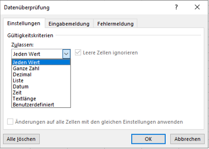
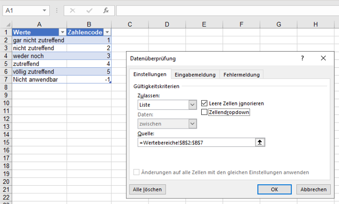

# Daten sammeln {#sec-chapter-daten-sammeln}

## Daten direkt eingeben

Bei der direkten Eingabe von Daten muss zuerst eine Tabelle erstellt werden, in der die Daten gesammelt werden.

Damit die Daten einheitlich erfasst werden, benötigt die Tabelle ein Schema. In Excel wird diese Schema über die Tabellenüberschriften definiert und kann bei einer späteren Verarbeitung weiter angepasst werden (s. @sec-chapter-daten-importieren).

Wurde die Datentabelle mit einem Schema erstellt, dann können die Werte in die Tabelle eingetragen werden. Die Datenüberprüfung wird automatisch auf die neuen Werte angewendet. Daten werden der Tabellen hinzugefügt, indem in der Zeile unterhalb der Tabelle neue Werte eingetragen werden. Die Tabellenstruktur mit dem Schema wird automatisch erweitert.

Ein einfaches Datenschema umfasst nur die Spaltenüberschriften, die erfasst werden sollen. Dazu müssen die Tabellenüberschriften definiert werden. Die Tabellenüberschriften werden in der ersten Zeile der Tabelle eingetragen. Überschriften für weitere Merkmale können zu einem späteren Zeitpunkt noch ergänzt werden. Anschliessend werden die Überschriften markiert und es wird für diesen Bereich eine **Tabelle** eingefügt. Hierbei muss die Option `Tabelle hat Überschriften` aktiviert werden (s. @fig-tabelle-erstellen).

{#fig-tabelle-erstellen}

### Schemadefinition durch Datenüberprüfung

Die einfache Schemadefinition stellt nicht sicher, dass die Werte einheitlich abgelegt werden. Das kann später die Datenverarbeitung behindern. Die Schemadefinition durch Datenüberprüfung erlaubt die Wertebereiche der gemessenen Merkmale vorab festzulegen. Dadurch lassen sich potentielle Fehler bereits bei der Dateneingabe vermeiden. Hierzu ist es notwendig, die Wertebereiche und die zugehörige Datenklasse einer Spalte zu bestimmen. 

::: {.callout-tip}
# Praxis

Das Erstellen eines Schemas zur Dateneingabe ist in Excel zwar aufwändig, dennoch sollte dieser Schritt nicht übersprungen werden, weil die Datenüberprüfung die Datenqualität verbessert und die Datenverarbeitung erheblich vereinfacht.
:::

In Excel müssen Vektoren durch die Option *Datenüberprüfung* definiert werden. Die Option *Datenüberprüfung* findet sich im Ribbon unter *Daten* (s. @fig-datenueberpruefung-ribbon) im Abschnitt *Datentools* (s. @fig-datenueberpruefung-datentools-details). 

{#fig-datenueberpruefung-ribbon}

{#fig-datenueberpruefung-datentools-details}

Die Schemadefinition erfolgt in drei zusätzlichen Schritten:
 
2. Es wird eine *Platzhalterzeile* eingefügt, indem die Zelle unterhalb der ersten Überschrift ausgewählt wird. Die Platzhalterzeile wird benötigt, um die Datenüberprüfung zu definieren.
3. Für jeden Vektor wird mit der Option *Datenüberprüfung* eine Datenüberprüfung für den gewünschten Wertebereich definiert.
4. Die Platzhalterzeile wird gelöscht.

### Funktionsweise der Datenüberprüfung

Die Datenüberprüfung ist eine Funktion, die auf einen Bereich angewendet wird, wobei der Bereich eine einzelne Zelle, einer Zeile oder eine Spalte sein kann. Für das Schema einer Tabelle wird die Datenüberprüfung für eine Spalte eingerichtet. 

Die Datenüberprüfung wird Zellenweise konfiguriert, wobei die erste Zelle eines Bereichs die Referenzzelle ist. Die Datenüberprüfung wird auf die Referenzzelle angewendet und diese Konfiguration wird auf alle Zellen des Bereichs übertragen und automatisch so angepasst, dass die aktuelle Zelle überprüft wird. Dabei sind ein paar Besonderheiten zu beachten.

* Die Datenüberprüfung muss mit konstanten Adressen konfiguriert werden. Es muss also die doppelte Dollar-Adressierung (z.B. `$A$2`) verwendet werden. 
* Wird nicht die Referenzzelle als Adresse verwendet, dann erfolgt die Datenüberprüfung mithilfe der Werte der angegebenen Adresse. In den folgenden Zellen wird dann der relative Versatz zur Referenzzelle verwendet. 
* Konstante Werte müssen in der Datenüberprüfung explizit angegeben und nicht über Bezüge verwiesen werden.

Excel bringt einige vordefinierte Überprüfungen mit, die über die Dropdown-Liste ausgewählt werden können. Die meisten Überprüfungen sind für Zahlenintervalle definiert. Die Standardeinstellung `Jeden Wert` ist gleichbedeutend mit keiner Überprüfung, weil alle Werte als Eingabe akzeptiert werden. Generelle Überprüfungen von Datentypen sind nicht vorgegeben und müssen über die Option `Benutzerdefiniert` definiert werden.

{#fig-datenueberpruefung-dialog}

::: {.callout-note}
Wird die Datenüberprüfung auf eine Zelle in einer Tabelle angewendet und in der jeweiligen Spalte existieren noch keine anderen Werte, dann wird die Datenüberprüfung für die gesamte Spalte übernommen. Stehen in der Tabelle bereits Werte, dann müssen zuerst alle Werte in der Spalte ausgewählt werden, bevor die Datenüberprüfung eingerichtet wird. Neue Werte übernehmen die Datenüberprüfung der vorangehenden Zeile.
:::

### Datenüberprüfung für Zahlen, Zeichenketten oder Wahrheitswerte

Eine generelle Überprüfung für die fundamentalen Datentypen ist in Excel nicht vorgesehen. Solche Überprüfungen müssen über die Option `Benutzerdefiniert` festgelegt werden. 

Im Eingabefeld Formel kann eine beliebig komplexe Formel stehen. Die Formel muss einen Wahrheitswert zurückgeben. Wird der Wahrheitswert `WAHR` zurückgegeben, dann wird der Wert akzeptiert. Wird der Wahrheitswert `FALSCH` zurückgegeben, dann wird der Wert nicht akzeptiert.

Um die fundamentalen Datentypen zu überprüfen, können die Informationsfunktionen `ISTZAHL()`, `ISTTEXT()` und `ISTLOG()` verwendet werden (s. @tbl-datenueberpruefung-fundamentale-datentypen). Diese Funktionen geben `WAHR` zurück, wenn der Wert dem angegebenen Datentyp entspricht. Ansonsten geben sie `FALSCH` zurück.

| Datentyp      | Überprüfungsausdruck |
|---------------|----------------------|
| Zahlen        | `=ISTZAHL($A$2)`     |
| Zeichenketten | `=ISTTEXT($A$2)`     |
| Wahrheitswerte| `=ISTLOG($A$2)`      |

: Überprüfungsausdrücke für die fundamentalen Datentypen {#tbl-datenueberpruefung-fundamentale-datentypen}

### Datenüberprüfung für ganze Zahlen

Die Überprüfung ganzer Zahlen ist in Excel über die Option `Ganze Zahl` möglich. Diese Option überprüft, ob der Wert eine ganze Zahl ist. Diese Option kann aber nicht direkt für alle ganze Zahlen eingesetzt werden. Um alle zulässigen ganzen Zahlen zu erfassen muss unter der Option `Daten` der Punkt `größer als` ausgewählt werden. Anschliessend muss als `Minimum` der Wert `-9.99999999999999E+307` eingetragen werden (s. @fig-datenueberpruefung-ganze-zahlen). Dieser Wert ist der kleinste Wert, der in Excel als (ganze) Zahl erfasst werden kann [@microsoft_excel_2023]. 

{#fig-datenueberpruefung-ganze-zahlen}

### Datenüberprüfung für ordinalskalierte Wertebereiche

Für ordinalskalierte Wertebereiche sollten die Werte am Besten als Ganzzahlen erfasst werden. Damit zu einem späteren Zeitpunkt diese Zahlen den eigentlichen Werten zugeordnet werden können, wird eine Zuordnungstabelle benötigt. Diese Zuordnungstabelle wird in einer separaten Tabelle erstellt. Diese Tabelle besteht aus zwei Spalten: Dem Zahlenwert und dem zugeordneten Wert. Die Ordnung der Werte ergibt sich aus der Ordnung der zugeordneten Zahlen.

::: {.callout-important}
Häufig muss bei ordinalskalierten Wertebereichen die Option einer nicht zutreffenden Antwort berücksichtigt werden. In diesem Fall muss eine zusätzlicher Zahlenwert ausserhalb der regulären Ordnung definiert werden. Dieser Wert wird dann der nicht zutreffenden Antwort (z.B. `NA` oder `nicht zutreffend`) zugeordnet.
:::

Damit der Wertebereich korrekt eingeschränkt wird, muss die Option `Liste` verwendet werden. Die `Quelle` entspricht der Spalte mit den zugeordneten Zahlenwerten in der Zuordnungstabelle. Die Option `Zellendropdown` kann deaktiviert werden.

::: {.callout-warning}
## Achtung

Die Datenüberprüfung kann nicht mit Tabellenadressen umgehen. Deshalb müssen die gültigen Werte als absolute Arbeitsblattadressen angegeben werden (s. @fig-datenueberpruefung-mit-zuordnungstabelle).
:::

{#fig-datenueberpruefung-mit-zuordnungstabelle}

### Datenüberprüfung für nominalskalierte Wertebereiche

Die Überprüfung nominalskalierter Wertebereiche wird in Excel durch die Option `Liste` realisiert. Die Option `Liste` erlaubt die Auswahl von Werten aus einer Liste in der gleichen Arbeitsmappe. Diese Liste ist einfach ein Bereich mit Werten, eine Spalte in einer anderen Tabelle oder eine benannte Liste (s. @sec-chapter-variablen-fkts-ops). Die Liste muss in einer Spalte definiert werden, weil die Datenüberprüfung nur auf Spalten angewendet werden kann. Deshalb ist es nicht möglich, eine zeilenorientierte Liste für die Datenüberprüfung anzuwenden.

Für nominalskalierte Wertebereiche werden alle zulässigen Werte in einer Spalte gestgelegt. Anschliessend wird im Dialog Datenüberprüfung unter `Quelle` der Bereich mit den zulässigen Werten angegeben.

::: {.callout-tip}
Im Gegensatz zu ordinalskalierten Wertebereichen, sollten nominalskalierte Wertebereiche nicht als Zahlen kodiert werden, sondern als Zeichenketten erfasst werden.
:::

Bei der Dateneingabe wird anschliessend ein Auswahlliste mit den zulässigen Werten, so dass die Werte nicht mehr direkt eingetippt werden müssen. Diese Auswahlliste kann unterbunden werden, wenn die Option `Zellendropdown` deaktiviert wird.
